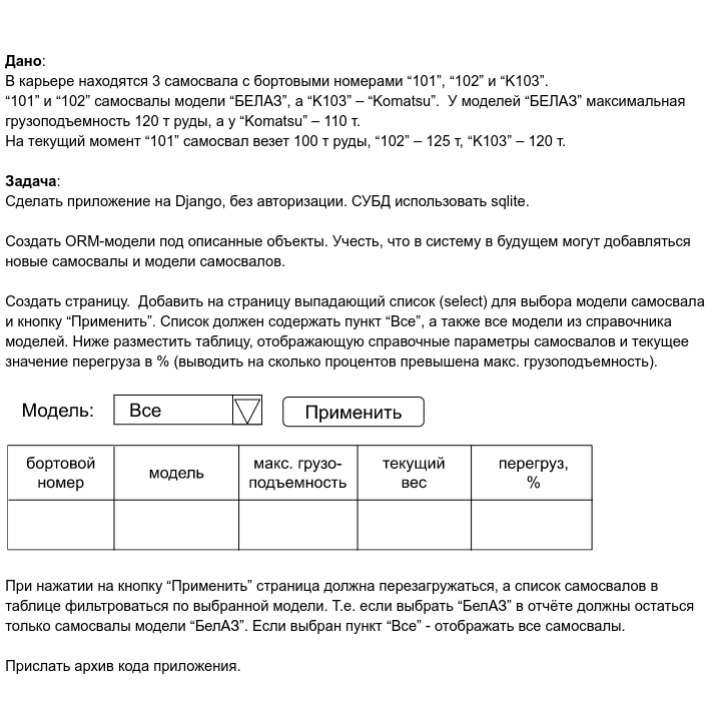

# Решение

У меня Django-фреймворк для Python обёрнут в Docker-контейнер и развернут на сервере http://51.250.5.32:8000/

### Требования:

Система: Ubuntu 20.04 или любая Unix-подобная система

Docker version 20.10.7

docker-compose version 1.29.2

### Инструкция

```
git clone https://github.com/erdenirf/py_django_test
cd py_django_test
sudo docker-compose up -d
```

также сервер нужно добавить в /mysite/settings.py
```
ALLOWED_HOSTS = ['51.250.5.32']
```

### Открываем порты в Ubuntu 20.04

```
sudo iptables -I INPUT -p tcp -m tcp --dport 8000 -j ACCEPT
sudo service netfilter-persistent save
```

### Результат

http://51.250.5.32:8000/
